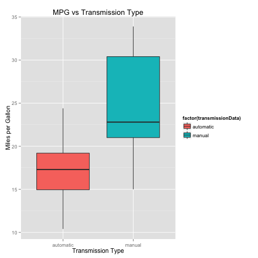

You work for Motor Trend, a magazine about the automobile industry. Looking at a data set of a collection of cars, they are interested in exploring the relationship between a set of variables and miles per gallon (MPG) (outcome). They are particularly interested in the following two questions:

“Is an automatic or manual transmission better for MPG”
"Quantify the MPG difference between automatic and manual transmissions"


### Loading data


```r
data(mtcars)
transmissionData <- factor(mtcars$am, labels = c("automatic", "manual"))
summary(transmissionData)
```

```
## automatic    manual 
##        19        13
```


### Data Visualization

Using the mtcars data we make a plot to see the the relationship between mpg variable and transmission type variable (am).


```r
library(ggplot2)

p <- ggplot(mtcars, aes(factor(transmissionData), mpg))
p <- p + geom_boxplot(aes(fill=factor(transmissionData)))
p <- p + ggtitle('MPG vs Transmission Type')
p <- p + labs(x='Transmission Type', y='Miles per Gallon')

print(p)
```

 

In the graphic above, it is shown that the transmission type have a significant impact on MPG variable, so it appears that the manual transmission is better than the automatic.

### Data Analysis

Mean test to determine whether the means of two groups are equal to each other.


```r
t.test(mpg~am, data=mtcars)
```

```
## 
## 	Welch Two Sample t-test
## 
## data:  mpg by am
## t = -3.7671, df = 18.332, p-value = 0.001374
## alternative hypothesis: true difference in means is not equal to 0
## 95 percent confidence interval:
##  -11.280194  -3.209684
## sample estimates:
## mean in group 0 mean in group 1 
##        17.14737        24.39231
```

The p-value is low so we can reject the null hypothesis so the manual transmission seems to be better for the mpg variable.

### Regression


```r
reg_model_01 <- lm(mpg~am, data = mtcars)
summary(reg_model_01)$coef
```

```
##              Estimate Std. Error   t value     Pr(>|t|)
## (Intercept) 17.147368   1.124603 15.247492 1.133983e-15
## am           7.244939   1.764422  4.106127 2.850207e-04
```

### Results

The regression coefficient can be interpreted as follows: if we only use am (transmission type) as predictor, cars with manual transmissions have mpg values 7.2 higher than those cars with the automatic transmissions. 

